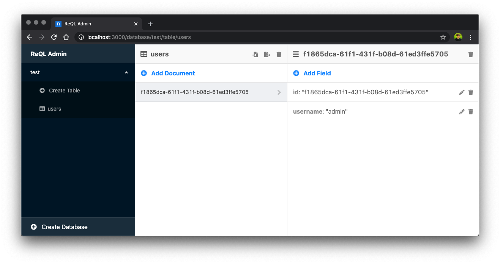

# ReQL Admin

A future Administration GUI for RethinkDB.

  

You can do the following as of now:

- Create Database
- Create Table
- Create Document
- Export table to CSV (JSON is available, just not in the UI yet.)
- Delete Table
- Update field in Document
- Create field in Document (Sub-collection support)
- Delete field in Document

----
**Disclaimer - This is an early release of the tool. This could mean that the tool is not yet production ready due to existing bugs.**
----

# Contributions

Want to contribute? Feel free to submit pull requests, create issues, and help with existing issues. The goal here is to create an up to date tool for easy RethinkDB administration.

# Known Bugs
- [ ] When editing a field, if the field name is changed, it will add it, but not delete the old one.

# Roadmap Features
- [ ] Import JSON / CSV into Tables
- [ ] Handle when websocket-server is not online
- [ ] Create connection screen (Specify websocket address, database information)
- [ ] Figure out why changefeeds are not reporting back once subscribed to.
- [ ] Filtering on DatabaseTable component
- [ ] Renaming a database

# Requirements

You must be running a rethinkdb websocket server so that the client can run queries. Please either refer to `rethinkdb-websocket-server`, or run the one that comes with this application in `/reql-ws`.

# Running ReQL-WS

- `cd reql-ws && yarn`
- `yarn start`

# Running in Browser

- `cd client && yarn`
- `yarn start`

**NOTE: REQL ADMIN ASSUMES YOU HAVE A WEBSOCKET-SERVER RUNNING ON PORT 8000 AT THE MOMENT. THIS WILL BE UPDATED AT A LATER DATE ONCE THE APPLICATION IS MORE DEVELOPED**
